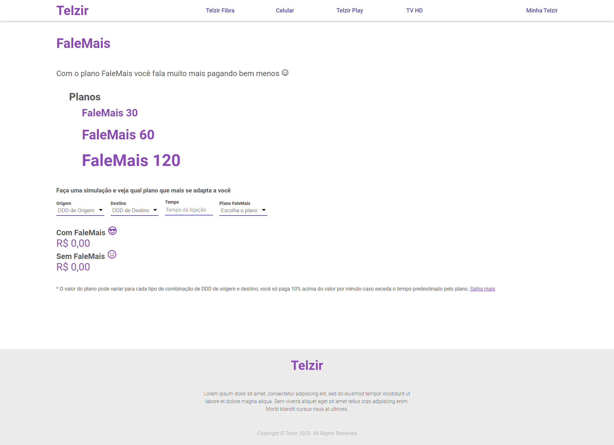

# Telzir

Provedora de telefonia.

  
  

## Construído com React utilizando
    - React
    - Typescript 
    - React-router-dom
    - Styled-components 
    - Axios

Estrutura pronta para escalar
    
## Como rodar 

### `npm install`

Instalar as dependências.
Logo após inicie com

### `npm start`

Iniciar aplicação
Abra [http://localhost:3000](http://localhost:3000) para visializar no navegador.

### `npm test`

Teste unitários simples com @testing-library/react 

### `npm run build`

Compila o aplicativo para produção na pasta `build`.\